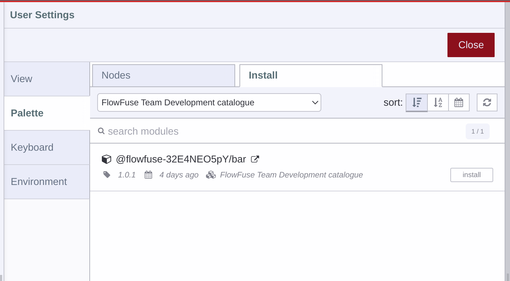
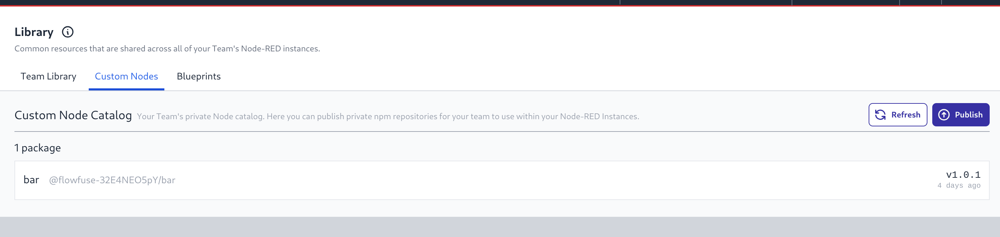

For Team and Enterprise tier Teams on FlowFuse Cloud we are introducing a NPM package repository giving you a place to host custom Node-RED nodes.

These Node-RED nodes can be used in both Hosted and Remote Instances and will show up in a custom catalogue with the name "FlowFuse Team [team name] Catalogue" in the Node-RED editor.

{data-zoomable}
_Custom Catalogue_

A list of NPM Packages published to the Team's repository can be seen under the Team's Library section in the "Custom Nodes" tab

{data-zoomable}
_Custom Nodes list_

This feature is also available to self hosting Enterprise customers on Kubernetes with Docker following shortly.