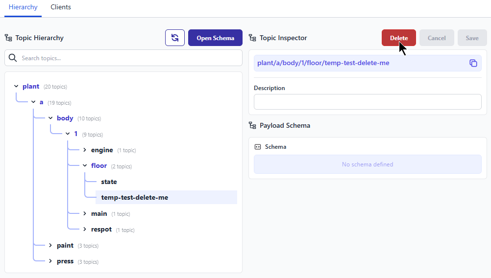

We are always looking for ways to improve FlowFuse and today, we have made a small but notable addition: the ability to delete old topics from your hierarchy.

This helps you keep things tidy and not clutter your hierarchy with old topics. Note that if the topic is published to again and detected by the platform, it will get added back.

{data-zoomable}
_Screenshot of the new Topic Delete feature_

