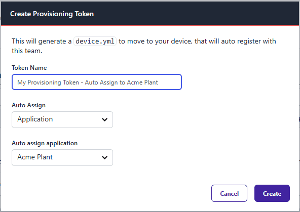

FlowFuse has had the ability to provision devices at scale for some time now, but assigning devices to an application has, until now, been a manual process.

In this update, we have added the ability to have your bulk provisioned remote instances automatically assign themselves to an application upon creation.

This will save you a lot of time if you have a large number of remote instances to provision.

{data-zoomable}
_Screenshot of creating a provisioning token_

Checkout the Bulk Registration section in the [Device Agent Registration](https://flowfuse.com/docs/device-agent/register) documentation for more information on how to use this feature.
