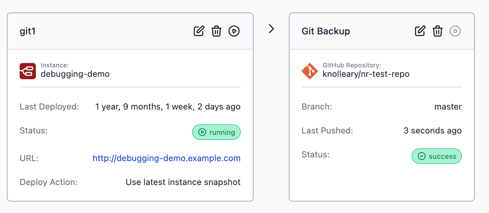

From today, Team and Enterprise tier teams on FlowFuse Cloud are able to add a Git Repository stage to their deployment pipelines. When the pipeline is triggered, the latest snapshot will get pushed to the configured repository.

This has been one of those features that has come up a number of times with our users; we knew we wanted to have Git integration in the platform, but we also wanted it to fit in a natural way with the developer workflows we provide.

This is very much a "first-iteration" of the feature that will allow us to get feedback early and continue to iterate.

With this release, the following restrictions apply:

 - Only GitHub.com hosted repostories are supported
 - Users must create a GitHub Personal Access Token and add to their Team Settings
 - We currently only support pushing snapshots to a Git repository

This last point is important; this release lets you backup your flows to git, but we haven't yet enabled the return journey of pulling a snapshot from a Git repository back to your Node-RED instance. That'll come in the near future and will unlock a full git-based review workflow within the pipelines.

We'll also look at enabling other Git hosting providers - let us know which you'd like to see on the list.

{data-zoomable}
_Screenshot of a Git Pipeline Stage_
