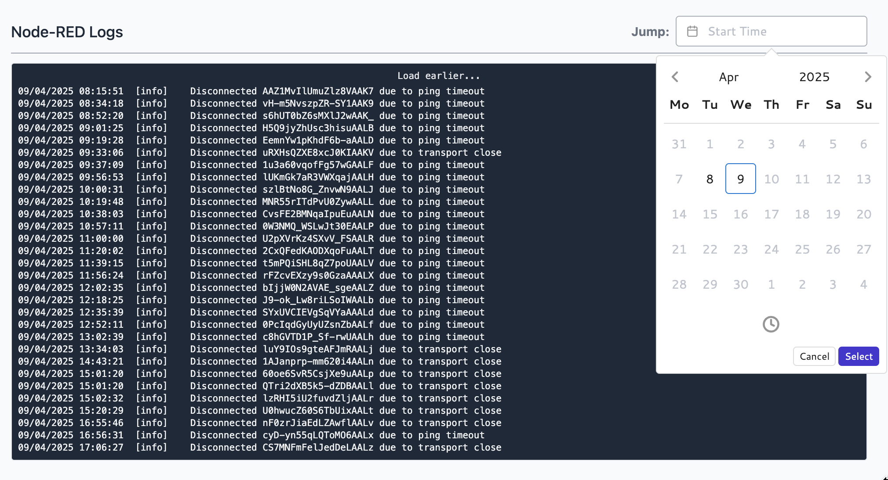

We've improved the log handling within our Hosted Node-RED instances. Previously we were using a fix sized buffer in memory; meaning the noiser your Node-RED instance was, the less history you'd have. The UI for browsing the logs was also awkward when you wanted to jump back to an earlier section of the logs.

With this release, once you update your instances to the latest version, we will
now store the last 7 days worth of logs for each hosted Node-RED instance.

To go along side this, we've added the ability to jump to a specific time/date in the logs without having to endlessly scroll.

To start benefiting from the extended logs, make sure you update the latest version via your Instance Settings page.

{data-zoomable}
_Screenshot of browsing Node-RED logs by timestamp_
