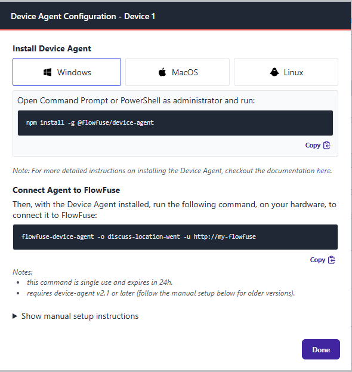

# Import your Node-RED flows when setting up your Remote Instance

FlowFuse Device Agent now supports importing Node-RED flows during the setup process. This feature streamlines the configuration of your Remote Instance by allowing you to:

- Select an existing Node-RED flows directory from your device.
- Choose a specific flows file to import.
- Automatically import associated credentials and package files.

### How it works

1. **Setup Command**: Run the setup command provided in the FlowFuse interface.
2. **Flow Selection**: During setup, you will be prompted to import existing Node-RED flows. Options include:
   - Skipping the import.
   - Selecting a default Node-RED directory (e.g., `.node-red`).
   - Specifying a custom path.
3. **File Selection**: If a directory is selected, you can choose a specific flows file to import.
4. **Automatic Import**: The Device Agent will handle importing credentials, package files, and generate a snapshot to the FlowFuse Platform, setting it as the "Target Snapshot" for the device.

### Notes

- When your Remote Instance is started, it will install all the necessary pieces and run your new Snapshot.
- The Remote Instance must be assigned to an application before running the **Setup Command**
- Requires Device Agent v3.3.1
- Available on FlowFuse Cloud today. For self-hosted customers, you'll need FlowFuse version 2.17

### Screenshots

{data-zoomable}
_Screenshot of the FlowFuse interface for configuring a Remote Instance_

{data-zoomable}
_Screenshot of the new import options in the Device Agent during setup_

We hope this enhancement simplifies the process of migrating existing Node-RED flows to FlowFuse.