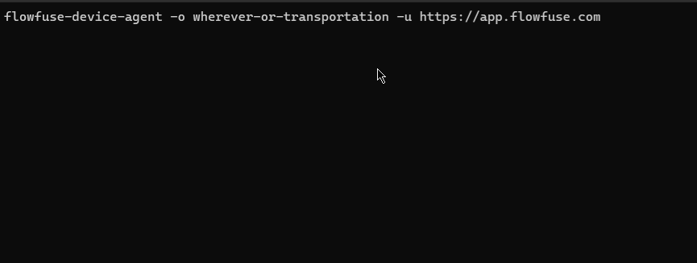
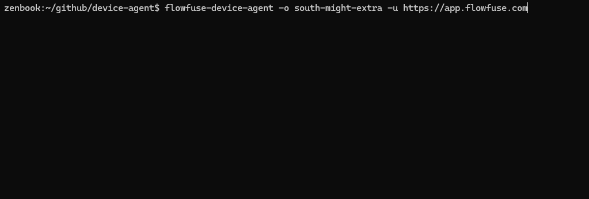

Last month we introduced a way for the FlowFuse Device Agent to import Node-RED flows during the setup process. Today, we have built on that and added some new features:

- Automatically scan common file locations and offer any flows found for immediate selection
- Scan common directories and present any that contain multiple flows as a quick browse selection
- Offer a "Browse filesystem" option to let you navigate and select any flows on your device

### Lets see it in action

**Import automatically located `~/.node-red/flows.json` flows file**

{data-zoomable}
_Screenshot of the Importing an Automatically located flows file during Device Agent Setup_

**Using the "Browse filesystem" option to navigate the filwsystem to chose a different flows file**

{data-zoomable}
_Screenshot of Browsing the filesystem for flows file during Device Agent Setup_

We hope these new enhancements make the process of migrating existing Node-RED flows to FlowFuse even easier.
