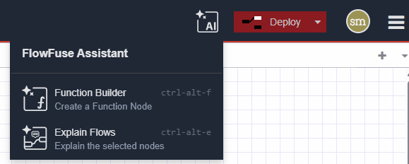
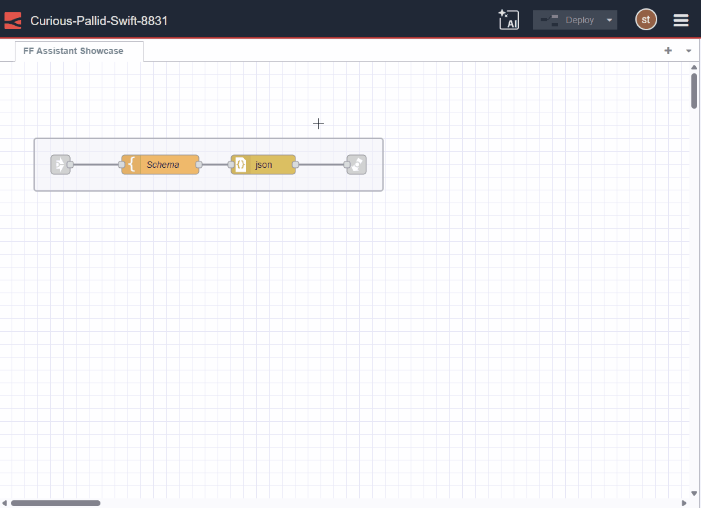
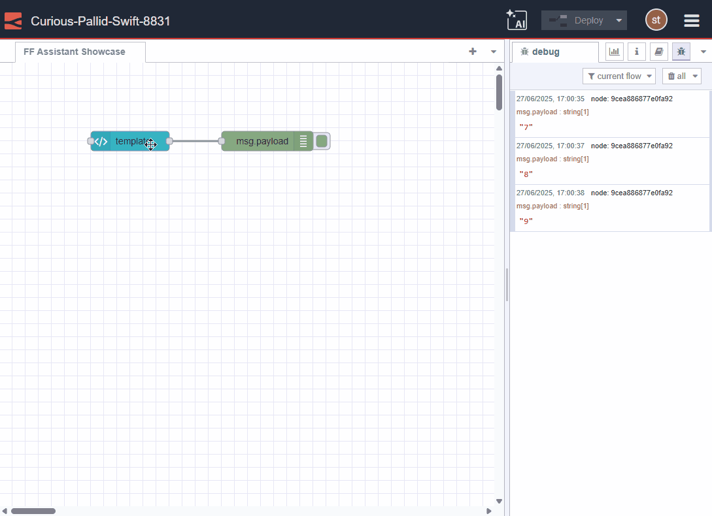
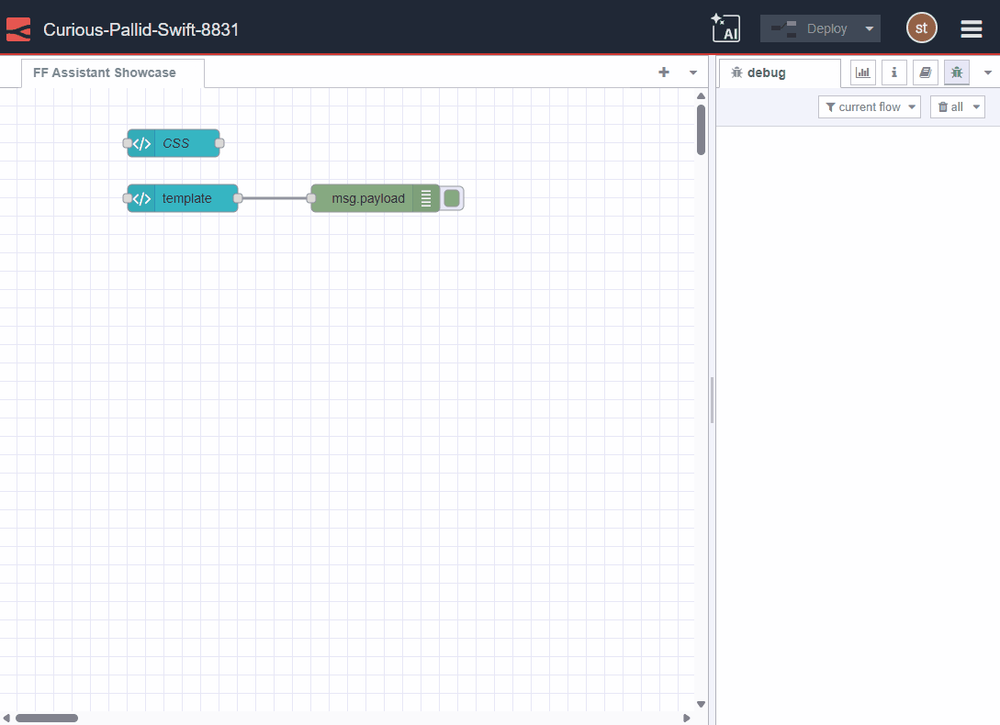
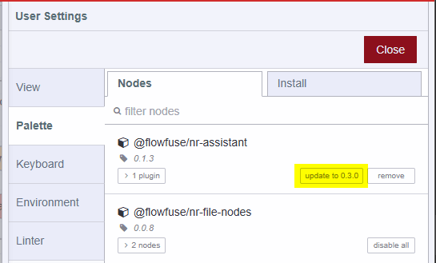
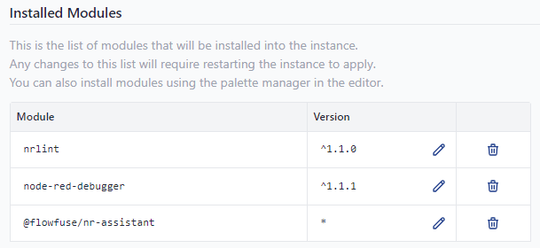

Following on from the recent improvements we made earlier this month, we have added even more goodness to the FlowFuse Expert:

We have: 
- Added a menu for quick access to the new features
- Improved the look and feel of the Flow Explainer
- Added a codelens to assist you creating HTML, VUE, Vuetify & CSS in FlowFuse Node-RED Dashboard templates

And there more to come in the next week - stay tuned!

#### New Menu

{data-zoomable}
_Screenshot of the new Assistant Menu_

#### Flow Explainer updated look & feel

{data-zoomable}
_Animated GIF showing the Flow Explainer Updated Layout_

#### New Codelens for building ui-templates

{data-zoomable}
_Animated GIF showing the Assistant building HTML & VUE template code_

{data-zoomable}
_Animated GIF showing the Assistant building CSS styles_

#### Updating the Assistant
If you are running Node-RED v4.x, head over to the Palette Manager, update the plugin and restart your instance.

{data-zoomable}
_Screenshot of Updating the Assistant for a Node-RED 4 instance_

If you are still running Node-RED v3.x we strogly recommend you update your stack to use Node-RED v4.x but you can
still manually update the plugin by adding `@flowfuse/nr-assistant` to the instance settings then restart it.

{data-zoomable}
_Screenshot of Updating Assistant for a Node-RED 3 instance_
