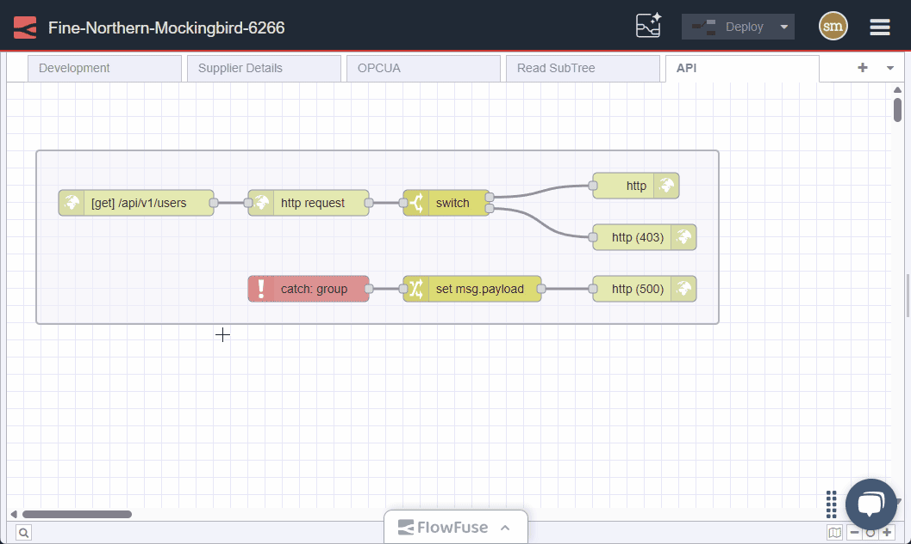
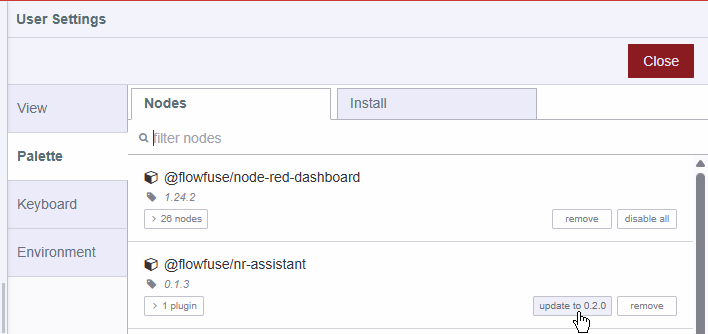

Last year, we introduced the FlowFuse Expert, a Node-RED plugin designed to assist FlowFuse users with tools for developing their Node-RED instances. Today, we are excited to announce that the Assistant has been updated with a new feature powered by AI: the Flows Explainer. This feature uses AI to analyze your Node-RED flows and provide a detailed explanation of what they do, making it easier for you to understand and manage your flows.

Stay tuned; this is just a taste of what is to come.

#### Flows Explainer

{data-zoomable}
_Screenshot of the FlowFuse Expert Flow Explainer_

#### Updating the Assistant
If you are running Node-RED v4.x, head over to the Palette Manager, update the plugin and restart your instance.

{data-zoomable}
_Screenshot of Updating assistant on Node-RED 4_

If you are still running Node-RED v3.x we strogly recommend you update your stack to use Node-RED v4.x but you can still manually update the plugin by adding `@flowfuse/nr-assistant` to the instance settings then restart it.

{data-zoomable}
_Screenshot of Updating assistant on Node-RED 3_

