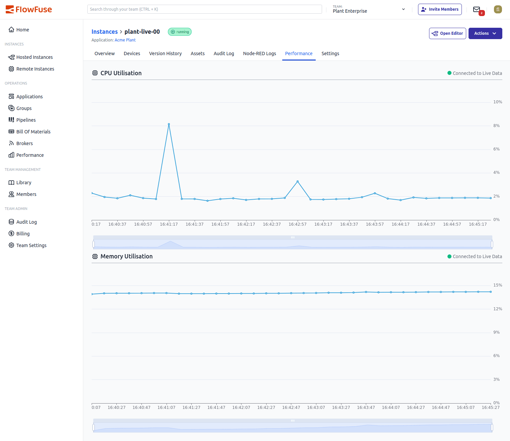

We're excited to announce an enhancement to the existing Performance view for Hosted Instances in FlowFuse. We've expanded the view to include a new Memory Utilization chart.

{data-zoomable}
_Screenshot of the Performance view with Memory Utilization_

This update provides additional insight, allowing you to monitor not only CPU usage but also memory consumption over time. The inclusion of memory metrics makes it easier than ever to detect performance issues and optimize your Node-RED Flows.
