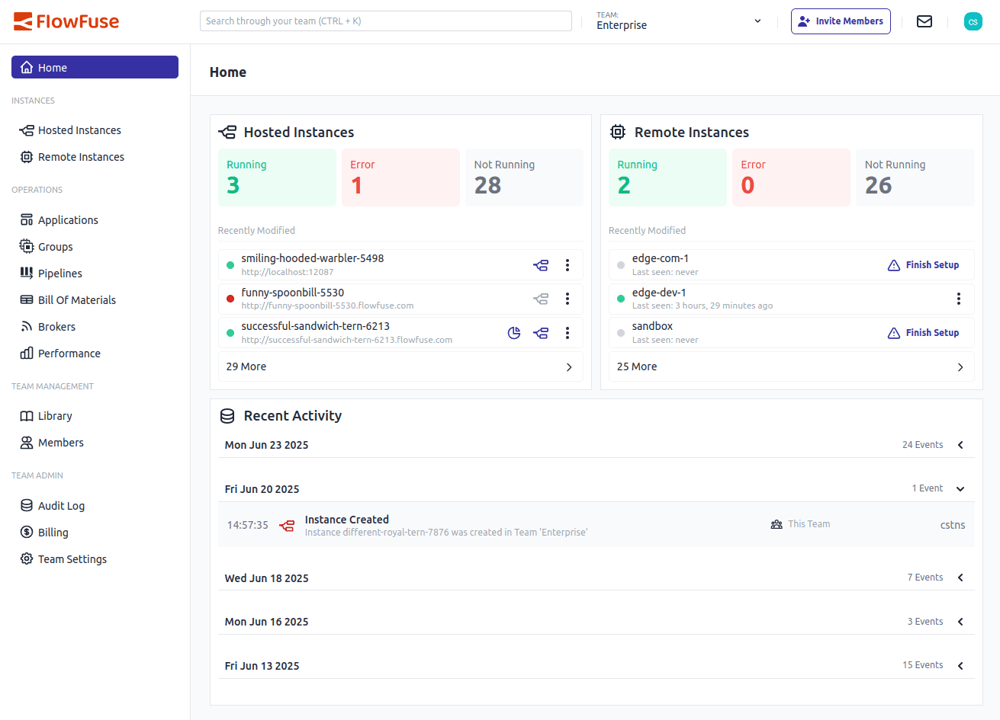

We’re excited to announce the release of the all-new **Home Page**, designed to simplify navigation and provide relevant information at a glance.

### Key Features

- A more intuitive and **dedicated landing page**, replacing the dual-purpose "Applications" view.
- **Recently Modified Instances**: The Home page highlights **recently modified hosted and remote instances**, providing key statistics at a glance:
    - Number of **running**, **error**, and **not running** instances.
    - Each tile is **clickable** for direct access.
- **Recent Activity Section**: A comprehensive view of the latest 50 changes made within the current team is now integrated, enabling better tracking of team activities and updates.

These enhancements are intended to make managing your instances and reviewing activity smoother and more effective.

{data-zoomable}
_Screenshot of the new home/landing page in FlowFuse_

This improvement aligns with the feedback we received from the community, aimed at delivering a more user-friendly and focused experience.
