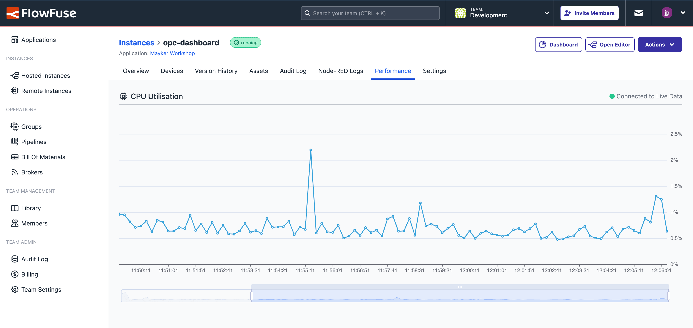

We've added a new view for every Hosted Instance in FlowFuse, Performance.

{data-zoomable}
_Screenshot of the Performance view for a Hosted Instance_

This view provides a comprehensive insight into the performance of your hosted Node-RED instances, focussing on CPU usage over time, better enabling you to detect performance issues within your Node-RED Flows.

This feature is available today for Enterprise tier teams on FlowFuse Cloud and will be available for self-hosted Enterprise customers as part of the 2.18 release later this week.