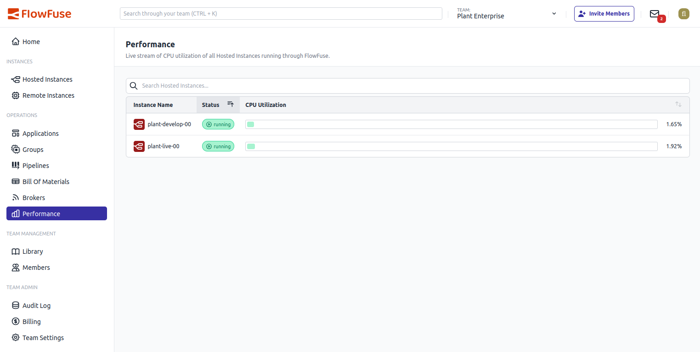

We’ve expanded the **Performance** feature with an exciting new addition: memory usage metrics.

### Key Features

- **Memory Usage Insights**: Provides a **team-wide overview** of all hosted instances, giving users a comprehensive bird's eye view of the memory allocation and usage across a team.
- **Enhanced Performance Understanding**: This addition ensures a holistic view of instance performance, aiding in better decision-making and upgrades.

This improvement is part of our continuous effort to provide a better user experience and responds directly to community feedback.

{data-zoomable}
_Overview of Memory Usage in the Performance Feature_
