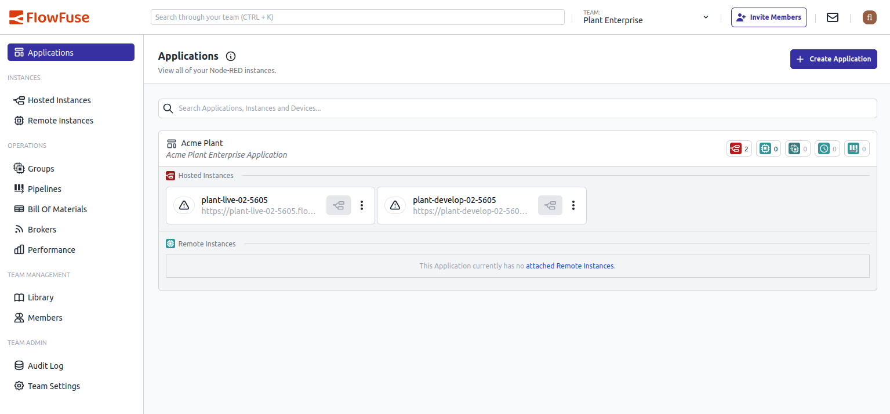

We’ve given the top navigation in FlowFuse a visual refresh as part of our effort to constantly improve and modernise the user experience of FlowFuse.

Menus now use a clean white background, with updated colors, spacing, and transitions across the user menu, team switcher, and notification buttons. Mobile menus have also been cleaned up for better usability.

This is the first step in a broader UI modernization effort based on community feedback.

{data-zoomable}
_Screenshot of the re-designed top navigation_
