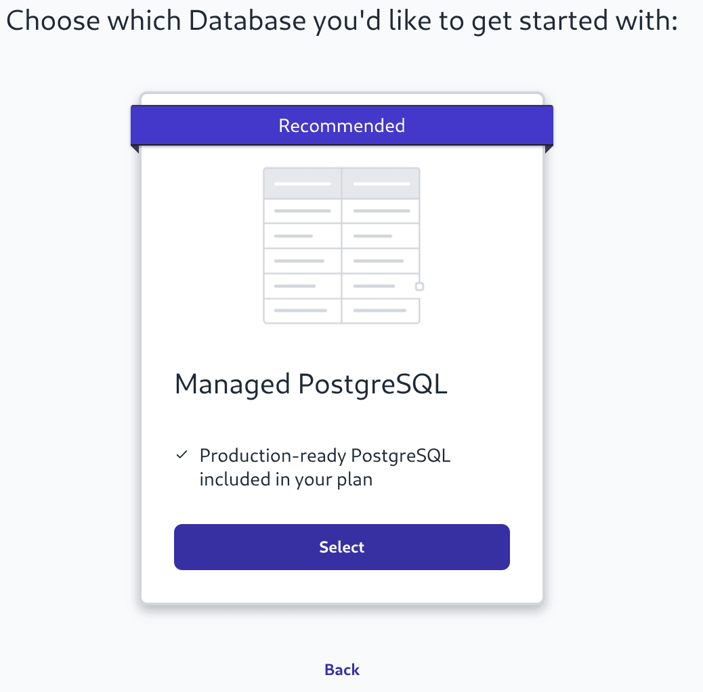

title: FlowFuse Tables
description: Adding a Team level Relational Database to FlowFuse
date: 2025-07-31 12:00:00.0
authors: ['ben-hardill']
tags:
  - changelog
issues:
  - "https://github.com/FlowFuse/flowfuse/issues/4911"
---

As part of the FlowFuse v2.20.0 release we are adding an option for a Team level hosted relational database.

{data-zoomable}
_Screenshot of create Database Wizard_

Tools to create tables and to show sample data are included, but we will be iterating on these moving forward.

{data-zoomable}
_Screenshot of Table Explorer_

Paired with the Database is a new FlowFuse Tables node which will automatically pick up the credentials when deployed in FlowFuse Hosted Instance running on v2.20.0 or newer Stack or when running with the latest version of the FlowFuse Device Agent.

{data-zoomable}
_Screenshot of Node-RED with FlowFuse Tables Node_

The database is a Postgres instance and you should be able to connect 3rd party clients using the credentials provided.

This feature will be available to FlowFuse Cloud Enterprise Tier customers and to Enterprise Licensed Self Hosted customers on Kubernetes to start with, we hope to make it available to Docker Compose users in an upcoming release.

It is currently marked as a [Beta Feature](https://flowfuse.com/handbook/development/releases/#beta-release) while we continue to iterate on adding new features and observe how it is used.
