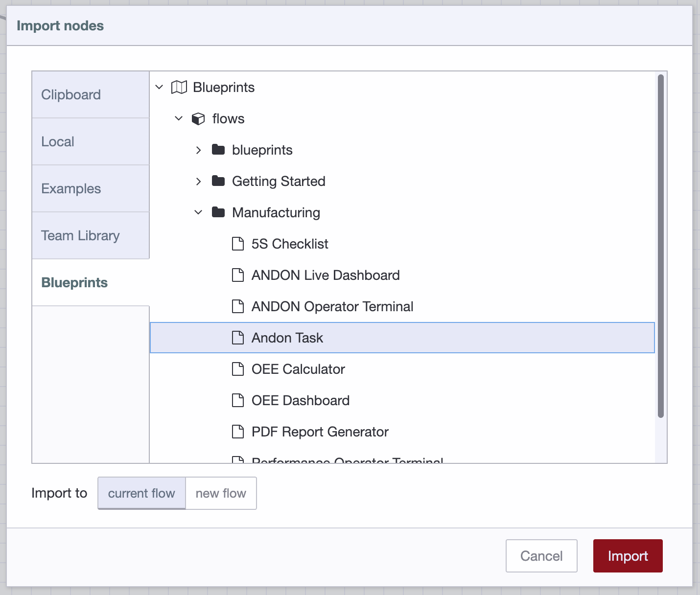

FlowFuse provides a growing [library of blueprints](https://flowfuse.com/blueprints/) that provide a great way to get started quickly with a pre-built solution across a range of scenarios.

With the 2.19 release of FlowFuse, instances that have been updated to the latest version can now import blueprints directly into their editor.

The Node-RED import dialog (`Ctrl-i` or the `import` menu option) now has a blueprints section. Under that you can browse the available blueprints by category and select one to import.

{data-zoomable}
_Screenshot of the Node-RED import dialog_

When you import a blueprint, you may get an error about 'unknown' nodes. This will be because the blueprint depends on Node-RED nodes you haven't currently got installed. You can check the [blueprint library](https://flowfuse.com/blueprints/) for details on what the blueprints require and then install them via the Palette Manager within Node-RED.

We recognise that isn't as smooth an experience as we'd like - but the good news is it's about to get much better. With the imminent Node-RED 4.1 release, the editor will be able to automatically install any missing modules for you. Keep an eye out for the 4.1 release annoucement and update your instances to take full advantage.
