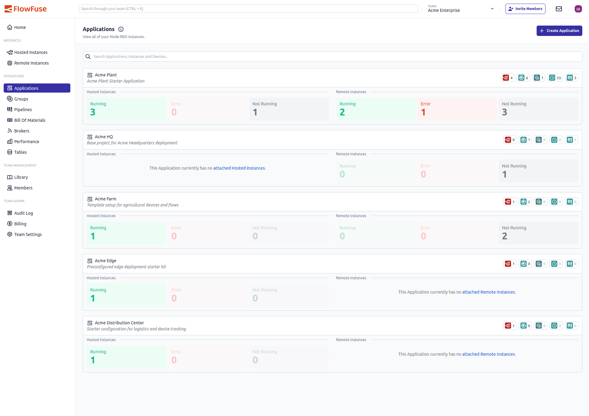

We’ve rolled out a redesigned **Applications Page** interface to give you sharper insight into instance status across hosted and remote deployments.

### Key Updates

* **Application Shortcuts Maintained**
  The existing shortcuts to **instances**, **devices**, **device groups**, **snapshots**, and **pipelines** have been retained in the new layout for easy access.

* **Summary Tiles for Each App**
  Instead of listing every instance individually, you now get compact summary tiles with counts of **Running**, **Error**, and **Not Running** instances for both hosted and remote groups. Visual layout is clean and instant to scan.

* **Grouped Instances by Status**
  Each application shows two separate tiles: one for hosted instances and one for remote. That way you see app health at a glance, without needing to drill into details.

* **Aggregate Status Tiles**
  Each status tile represents an aggregate count of instances in a given state (e.g. Running, Error). Clicking on a tile takes you to a filtered view of the underlying instances.

### Why This Matters

* Page load times have been significantly improved by reducing the number of rendered elements and simplifying data fetching.
* Cuts out clutter—no more scrolling through long lists.
* Quick status view helps you spot issues fast.
* Cleaner separation between hosted vs remote gives context instantly.

{data-zoomable}
_Screenshot of the Simplified Applications page_
