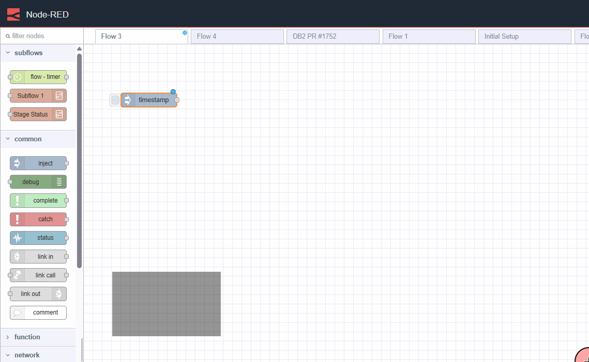

In conjunction with the release of Node-RED 4.1.0 and FlowFuse 2.20.0, we have added smart suggestions to the Editor.

When you drop a node onto the editor workspace, the upstream connected nodes in your flow are analysed and a next node suggestion is presented for quick insertion via the keyboard `TAB` key or the click of your mouse.
It presents up to 5 of the most common following nodes which can be cycled through using your keyboards `UP` and `DOWN` arrows, so even if the first suggestion isn't correct, it's very likely that the correct choice is only a key press away.

To achieve this, we processed thousands of real working flows and built a decision tree model for the greatest accuracy possible.

### Let's see it in action

{data-zoomable}
_Demo of smart suggestions_

We hope this new feature makes the process of writing flows for Node-RED flows in FlowFuse even easier.
