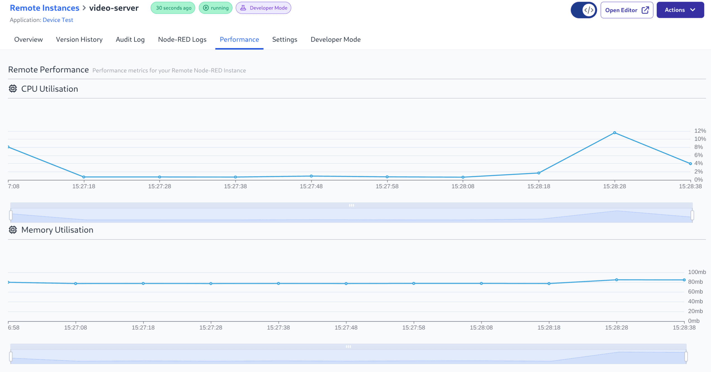

FlowFuse Device Agent version v3.6.0 combined with FlowFuse v2.21.0 allows you to monitor the CPU and Memory usage of Remote Instances

{data-zoomable}
_Screenshot of Device Performance data_

The view is available from the "Performance" tab on the Remote Instance page.

This feature is available to Enterprise customers on FlowFuse Cloud and to Enterprise licensed self hosting customers.