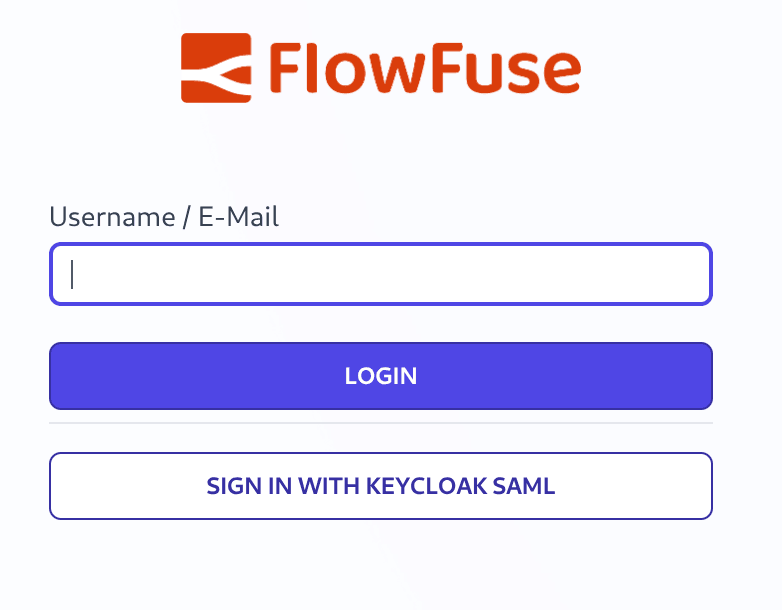
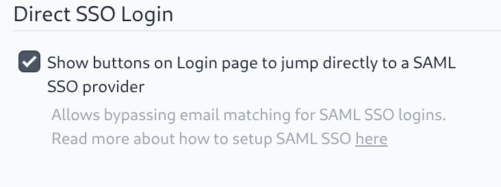

As part of FlowFuse release v2.21.0, self hosted Enterprise users will be able to enable direct SSO login from the FlowFuse login page.

{data-zoomable}
_Screenshot of FlowFuse Login Page with SSO Direct Button_

This can be enabled from the Admin Settings page. When enabled it will add a button for all SAML SSO configurations to the login page. These buttons bypass the email domain matching that would normally be used to select which SSO provider to use. This can be used when users use the same email domain but need to authenticate with different SSO providers.

{data-zoomable}
_Screenshot of FlowFuse Admin Settings for Direct SSO_