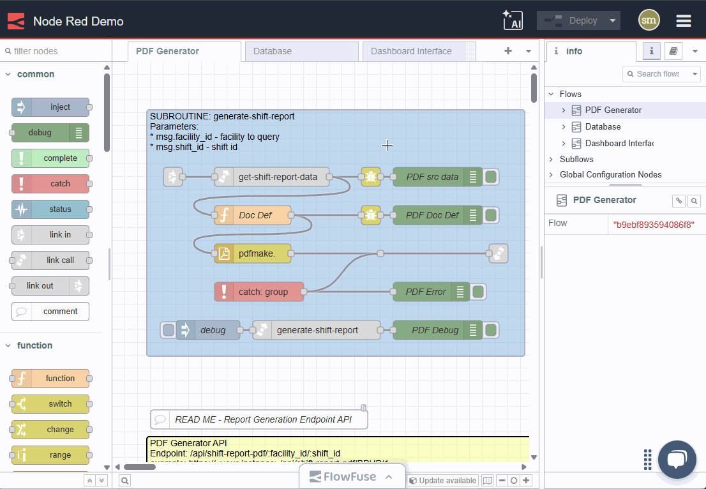

Recently, we introduced "Flows Explainer" to the FlowFuse Expert. It provides a concise description of the selected flows.
This turned out so well we thought "wouldn't it be good if the generated explanation could be persisted as built in documentation" so we added a single click option to add the documentation as a comment node to your flows.
We also provided a Copy to Clipboard button so you can grab it and add it to the Documentation section of a flow tab, node group or external documentation.

### Let's see it in action

{data-zoomable}
_Demo of documenting flows with the Flows Explainer_

While this feature is just a simple _quality of life_ addition, we are hopeful it is small touches like these that improve your daily workflow.
