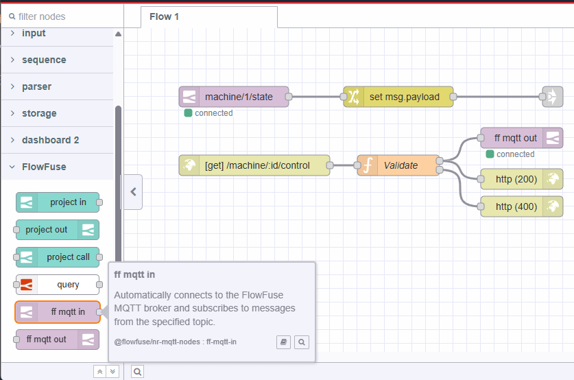
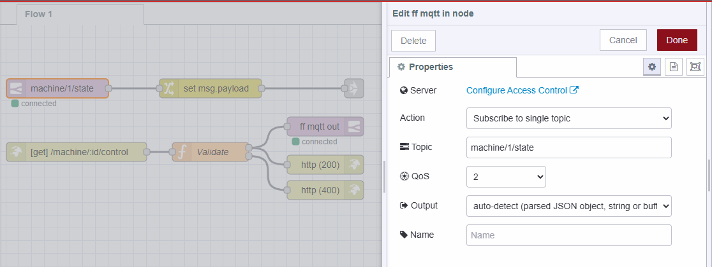

FlowFuse has offered a built in MQTT [Team Broker]"(/docs/user/teambroker) since FlowFuse v2.10.0 but setting up and using it was less than straightforward.

Today, we are adding dedicated MQTT nodes that require no setup to use. Just add a FlowFuse MQTT Node to your Node-RED instance,
deploy it & go.

Pretty much all of the capabilities of the Node-RED MQTT Nodes are present making it super simple to get up and running in no time. 

{data-zoomable}
_Screenshot of Node-RED with FlowFuse MQTT Nodes_

{data-zoomable}
_Screenshot of Node-RED with FlowFuse MQTT-in node edit panel_

To get the new FlowFuse MQTT Nodes in your Node-RED instance, you will need to be running the latest version of the FlowFuse Device Agent (V3.6.0 or greater) or a stack running with the FlowFuse launcher (V2.20.1 or greater) which will be released in the coming days.