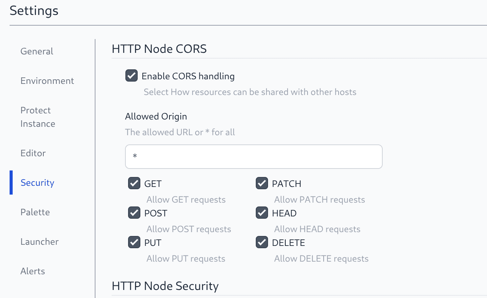

Included in FlowFuse v2.21.0 is the ability to configure the HTTP CORS response for HTTP routes served by the Node-RED instances.

This includes routes from HTTP-in/HTTP-response nodes and the Node-RED Dashboard.

{data-zoomable}
_Screenshot of Hosted Instance Security Settings_

This feature will require the latest Stack version and uses will be prompted to upgrade if required.