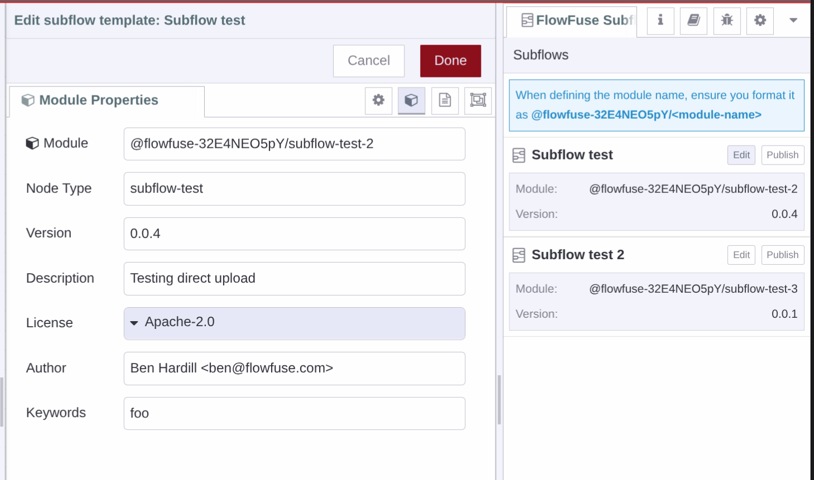
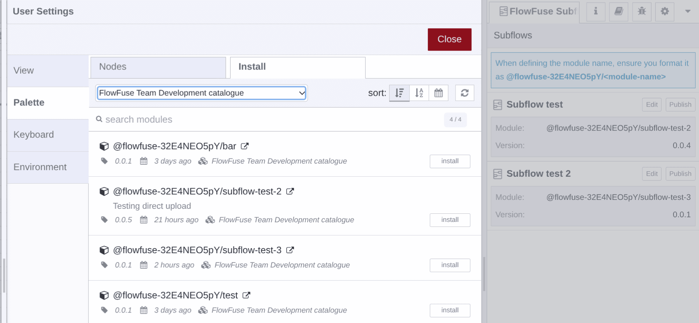

Instances running the latest Node-RED version on FlowFuse v2.21.0 will now be able to export Node-RED SubFlows as Node-RED nodes.

This is done from the Node-RED editor using a custom sidebar.

{data-zoomable}
_Screenshot of Node-RED with the SubFlow export sidebar_

The nodes are added to the Team's Library Custom Nodes and are installable into all of the Team's Node-RED instance from Catalogue generated from the Team Library.

{data-zoomable}
_Screenshot of Node-RED Manage Palette showing new SubFlow modules_

This feature is available to FlowFuse Cloud Pro and Enterprise teams and to Enterprise Self hosting users.