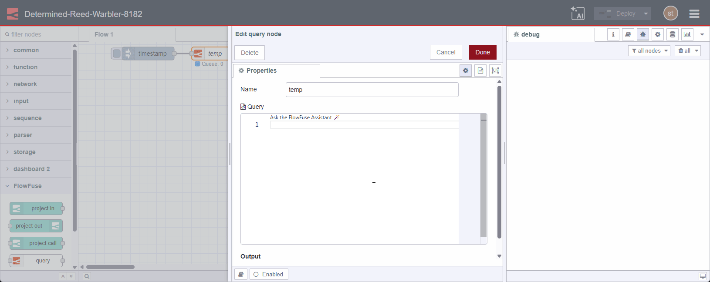

The new [Tables](https://flowfuse.com/blog/2025/07/flowfuse-release-2-20/#introducing%3A-flowfuse-tables) we introduced in FlowFuse 2.20.0 feature may be still in Beta but to help you make the most of it we have added a codelens to the query editor to help you get your queries written faster.

Behind the scenes, when you ask for assistance, we gather schema info and include this in the process of making a prediction as to the best tables and fields to use for in the query. 

### Let's see it in action

{data-zoomable}
_Demo of table node with assistance_
