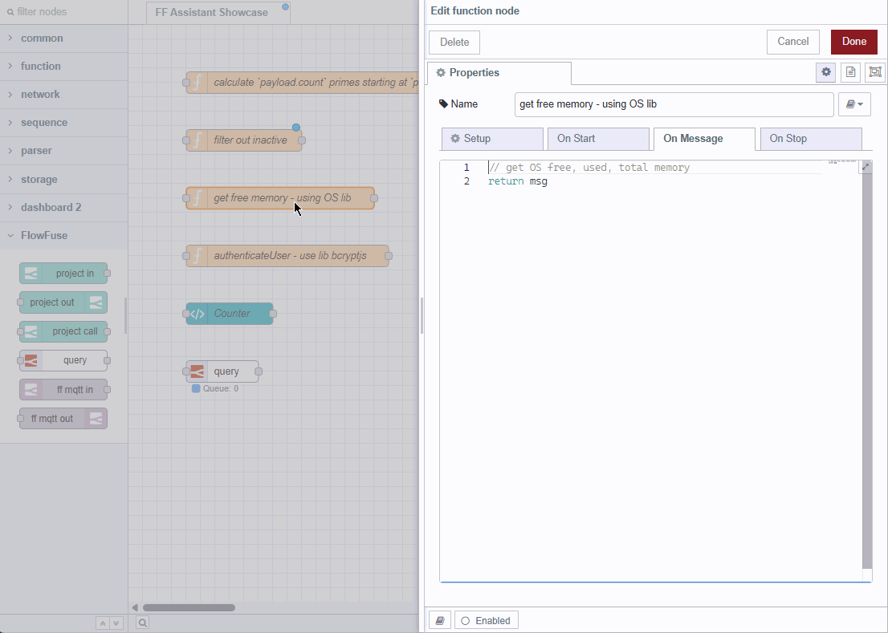
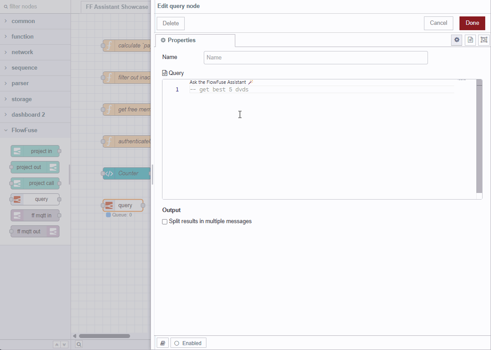
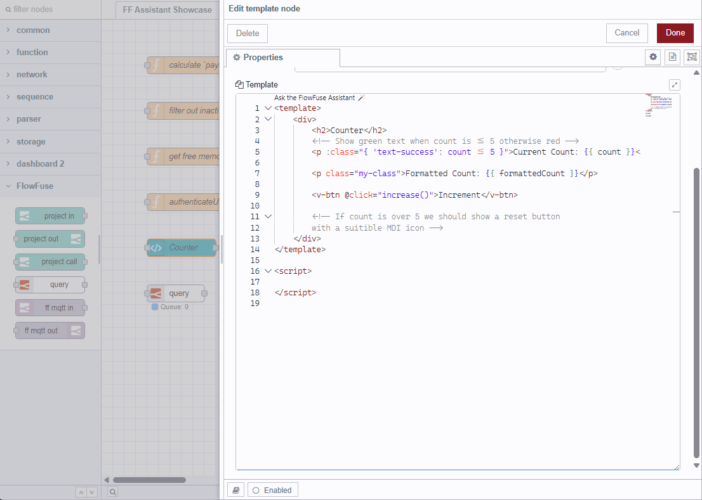

More goodness has been added to the FlowFuse Expert by way of inline suggestions as you type.
Initially, we have added support for the Function Node, Tables Query Node and the Dashboard Template Node.
It is contextually aware so will offer suggestions applicable to what it sees and what is already written.

### Let's see it in action

{data-zoomable}
_Demo of function node with inline completions

{data-zoomable}
_Demo of tables query node with inline completions

{data-zoomable}
_Demo of dashboard template node with inline completions

This will be made availabe to our Pro and Enterprise users in remote and hosted instances in the next update however
if you want to give it a go right away, you can update the FlowFuse Expert in the Node-RED Palette Manager today.
