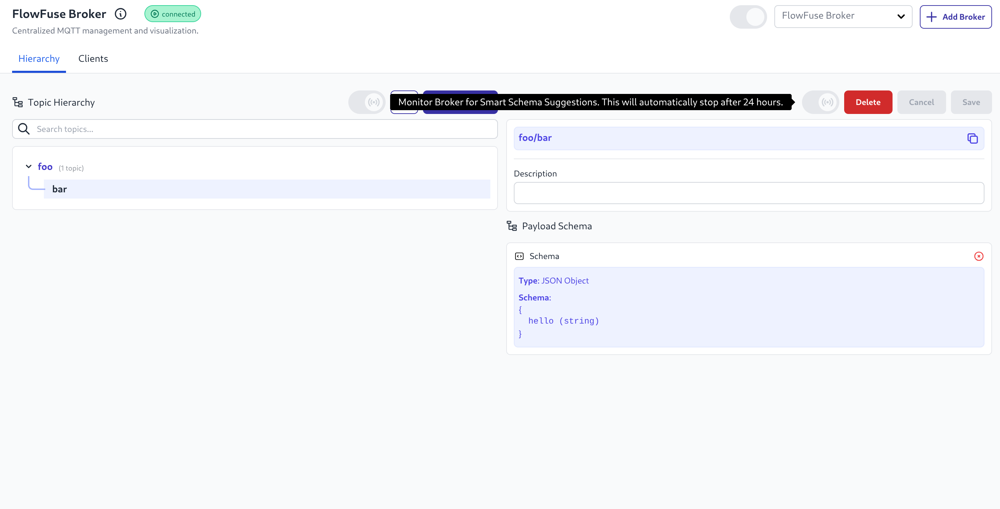

The FlowFuse Team Broker now includes automatically curated smart suggestions for the published payloads in each topic.

You can run this by simply toggling on the toggle found in the Topic Hierarchy view. This will run for 24 hours.

{data_zoomable}
_Team Broker Schema Capture_

Our agent will monitor for any payloads published on your broker in that time, and offer smart suggestions on data structure found. You can review these suggestions with the FlowFuse user interface, and confirm them where appropriate.

Once confirmed, the Async API documentation can be viewed by clicking on the "Open Schema" button. This means that your whole team can be aligned when building with your UNS.

This functionality was previously only available to 3rd party MQTT brokers using the MQTT Schema Agent, it is enabled on FlowFuse Cloud and will be available to Enterprise Licensed Self Hosted customers from v2.22.0.