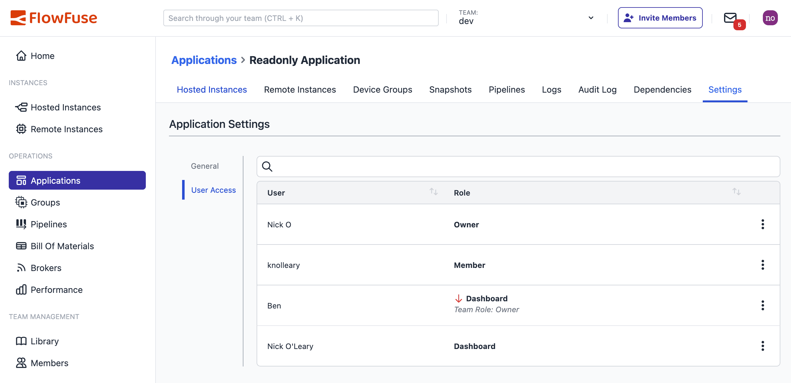

One of the super-powers FlowFuse brings is its role-based access control that gets applied across the team. This allows teams to have users with different levels of access to the Node-RED instances - from full editor access, to read-only access, to only being able to access the dashboards the instances create.

We've pushed this one step further today for Enterprise teams, allowing them to set a user's role on a per-Application basis. This finer-grained control gives teams more flexibility in how they can secure their resources.

For example, a team could create an Application dedicated to their production systems, with a limited set of users able to make changes - whilst having a Development application that is accessible to a broader group of user.

The roles for an application can be modified under the 'User Access' section of its settings. It shows what roles each user has for the application and where any application-specific overrides have been set. Here you can see I've reduced Ben to a Dashboard role for this application - sorry Ben!

As with managing the top level roles in a team, only Team Owners are able to modify the roles within an application.

{data-zoomable}  
_Application RBAC Settings_

