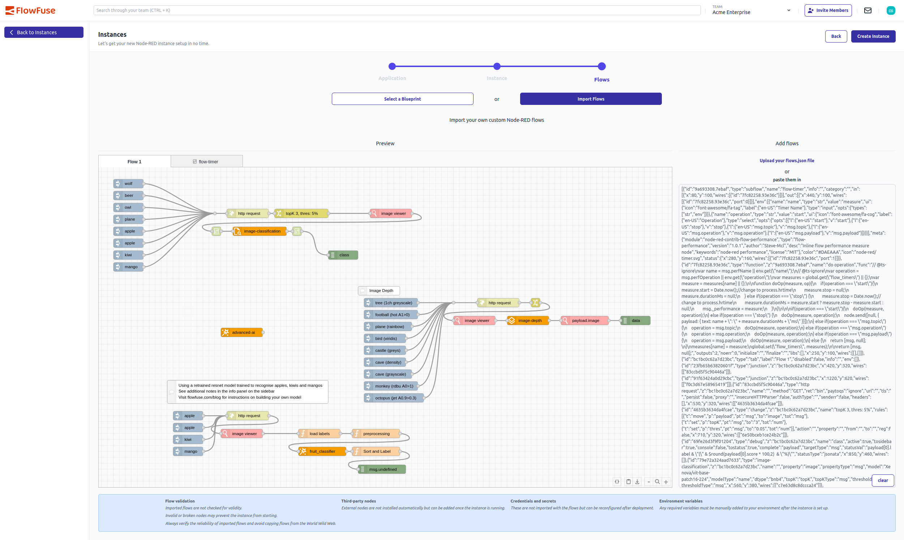

Getting started with FlowFuse just became easier! When creating a new Node-RED instance, you can now import your existing flows directly during the setup process.

This new capability allows you to jumpstart your FlowFuse journey by bringing in flows you've already developed, whether they're from a local Node-RED installation, exported from another system, or shared by a colleague.

The import process is flexible and user-friendly:
- **File upload**: Simply select and upload a JSON file containing your flows
- **Direct paste**: Copy and paste flow JSON directly into a text area
- **Live preview**: See your flows rendered in real-time as you import them

The flows import step seamlessly integrates with the existing multi-step instance creation workflow. You can choose to start with a blueprint from our library or import your own flows - giving you multiple pathways to get productive quickly.

This enhancement is particularly valuable for teams looking to migrate existing Node-RED projects to FlowFuse or developers who want to quickly prototype with flows they've developed elsewhere.

## Important considerations

When importing flows, keep these key points in mind:
- **Flow validation**: Imported flows aren't checked for validity, so invalid nodes may prevent your instance from starting
- **Third-party nodes**: External nodes aren't installed automatically but can be added once the instance is running
- **Credentials and secrets**: These aren't imported with flows but can be reconfigured after deployment
- **Environment variables**: Any required variables must be manually added to your environment after setup

Always verify the reliability of imported flows and avoid copying flows from untrusted sources.

To try it out, simply create a new instance and look for the new "Flows" step in the creation wizard!

{data-zoomable}  
_Demo importing flows when creating a Hosted Instance_
