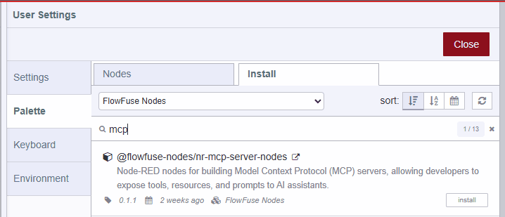

We’re excited to introduce **FlowFuse MCP Server Nodes** — a new contrib package that brings MCP Tools, Resources, and Prompts straight into Node-RED. With just a few nodes, you can design custom MCP-powered automations, connect dynamic resources, and return responses seamlessly in your flows. Whether you’re prototyping or extending integrations, these nodes make it faster than ever to put MCP to work in your applications.

Over the coming weeks, we’ll share use cases and demos to inspire you, but in the meantime, we’ve included some sample flows you can access directly in Node-RED via the import menu (`CTRL`+`I`) and some additional links below.

### What is MCP?

The **Model Context Protocol (MCP)** is an emerging open standard for connecting AI models with tools and data sources in a structured way. It defines how prompts, resources, and responses should be exchanged, making it easier to build reliable and reusable AI-powered workflows.

### Why is MCP important?

As AI adoption grows, developers need consistent ways to integrate models into real-world systems. MCP helps standardize this process, reducing boilerplate and ensuring interoperability across tools and platforms. With Node-RED support, FlowFuse makes it easier than ever for developers to experiment with MCP, build production-ready flows, and unlock the potential of AI-driven automation.

### Screenshots

{data-zoomable}  
_New MCP Nodes_

FlowFuse customers can install the MCP Server nodes today via the Node-RED Palette Manager from the **FlowFuse Nodes** catalog

### Additional links

- [Blog article](https://flowfuse.com/blog/2025/10/building-mcp-server-using-flowfuse/) 
- [Youtube demonstration video](https://www.youtube.com/watch?v=troUvaF8V68)

