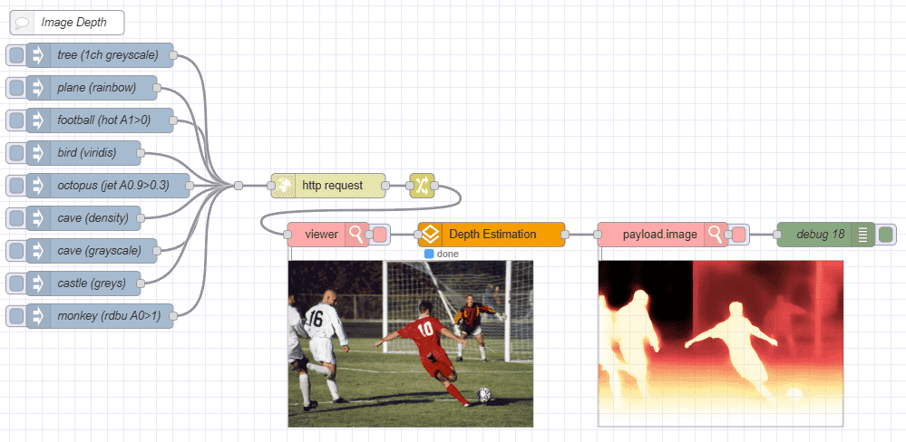

We’re excited to introduce **FlowFuse AI Nodes** — a new contrib package that brings the ONNX Runtime to Node-RED.

### What is ONNX?

ONNX (Open Neural Network Exchange) is an open format built to represent machine learning models. It provides an interoperable framework for AI developers to use models across different frameworks and tools.

Sounds great, right? So what does this mean for you?

You can now run pre-trained machine learning models directly within your Node-RED flows using the new FlowFuse AI Nodes.
There are hundreds of pre-trained models available in the [ONNX Model Zoo](https://onnx.ai/models/) or from [Hugging Face](https://huggingface.co/models?library=transformers.js,onnx&sort=trending), covering a wide range of applications including image classification, object detection, natural language processing, Text to Speech, and more.

### What can you do with FlowFuse AI Nodes?
In this first release, the FlowFuse AI Nodes package includes the following nodes:
- **ONNX Inference Node**: A bare node to run any model (including your own trained ONNX models). Just upload the model file and feed in the input data to get predictions.
- **Image Classification Node**: Classify images using pre-trained models like MobileNet, ResNet, or even use your own.
- **Object Detection Node**: Detect objects in images using models like YOLOv5, SSD, or your own.
- **Image Depth Estimation Node**: Estimate depth information from images.

With FlowFuse AI Nodes, you can easily integrate ONNX models into your Node-RED flows, enabling powerful AI capabilities without the need for extensive coding or machine learning expertise.

### How to Get Started

FlowFuse customers can install the new AI nodes today via the Node-RED Palette Manager from the FlowFuse Nodes catalog

We have included example flows directly inside the package to help you get started quickly.
Just hit `CTRL-I` in the Node-RED editor to import the example flows from the FlowFuse AI Nodes package.

Additionally, we have created a blog post detailing how you can train a simple image classification model to accompany the advanced example flow included in the package. You can read all about it here: [Deploy Custom-Trained AI Models: Using ONNX with Node-RED and FlowFuse](https://flowfuse.com/blog/2025/10/custom-onnx-model/)

### Screenshots

Here are a selection of screenshots of the built-in demo flows in action

{data-zoomable}  
_Running your own custom trained ONNX Model_

{data-zoomable}  
_Using a Text-to-Speech-model_

{data-zoomable}  
_Performing Image Depth Estimation_