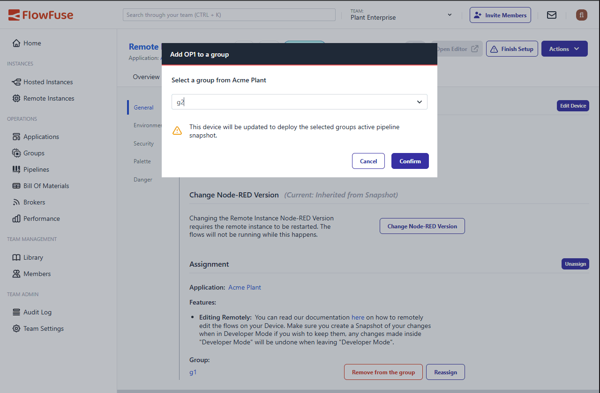

Managing which device group your Remote Instance belong to just got a easier. Previously, if you wanted to move a device to a different group, you had to identify the group the Remote Instance belongs to, remove it, then find the group to assign it to, edit that group and add it. This was not optimal.

With this update, you can now see which group a Remote Instance belongs to directly from the overview page, and easily reassign it to a different group from the settings page without the hassle of searching through your entire group structure.

The new device group management interface provides:

- **Clear visibility** - The current device group is displayed prominently in the Remote Instance overview
- **Quick reassignment** - A streamlined dialog allows you to select a new group from a searchable list from the Remote Instance Settings page
- **One-step process** – Device group changes are now completed in a single action, simplifying reassignment while maintaining safety and consistency.

This enhancement streamlines single Remote Instance reassignment, removing friction and making it faster to keep edge devices properly categorized as your infrastructure evolves.

{data-zoomable}  
_Device Group Management Interface showing current group and reassignment options_
