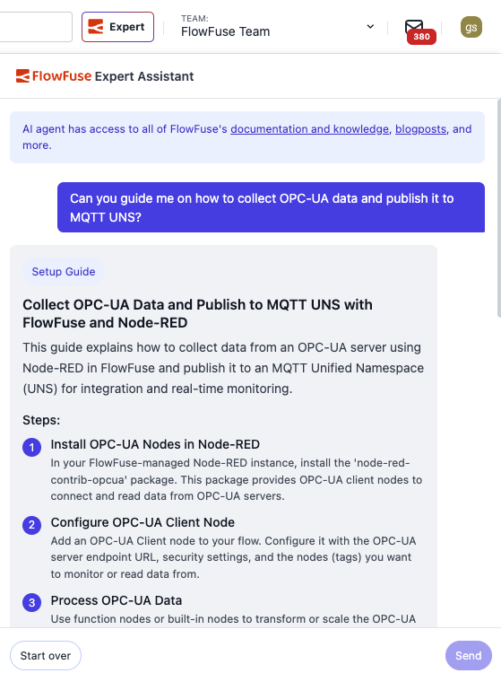

The FlowFuse Expert just got a major improvement: you can now start a conversation on the flowfuse.com homepage and continue it inside of FlowFuse and the Node-RED editor!

Now, when you use the Expert, you can bring your application-building instructions with you as you navigate.

This work involved major and important changes to the Expert UI, and brings us even closer to being able to build Node-RED flows using natural language inputs.

Give it a try! 

 
_Demo of option to continue chat in FlowFuse_

 
_Here is the in-app UI of the FlowFuse Expert_
