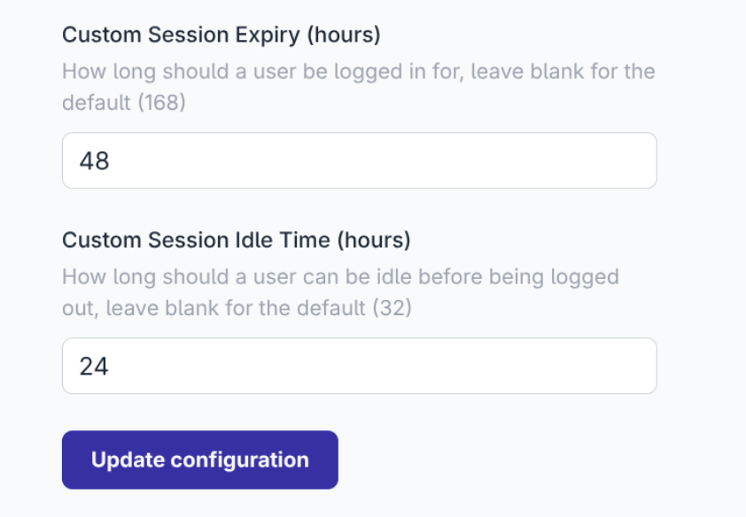

Customers on FlowFuse Cloud can now request custom Session Life times and Idle times. This allows the default times to be adjusted to match any in house policies that may be in place.

_SSO Session Expiry and Idle settings_

For existing FlowFuse Cloud customers please contact support if you would like to make changes to you existing configuration.

This will be available to Self Hosted customers in v2.24.0