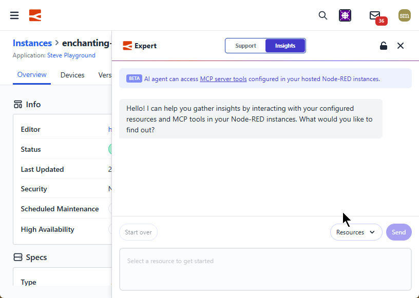

Recently, we introduced [MCP Server nodes](/changelog/2025/10/mcp-nodes/) which gave you the ability to infuse your Node-RED flows and data with AI. Today, we have given the FlowFuse Expert new powers by adding support for Model Context Protocol (MCP). This allows you to interact directly with your instances, tools, and data.

### Bridging the Gap Between AI and Your Data
By switching to the new Insights mode, the Expert gains the ability to use the MCP tools and resources you’ve built using FlowFuse MCP Server Nodes. This means you can now ask the Expert to analyze real-time data from your flows, query external databases, or trigger specific actions across your infrastructure.

### How to get started:

- **Deploy MCP Nodes**: Add MCP Tools or Resources to your Node-RED flows using our MCP Server nodes.
- **Switch to Insights**: Open the FlowFuse Expert interface and use the Mode Selector to switch from "Chat" to "Insights."
- **Select your Server**: Choose the MCP Server you want to include in your session.
- **Gain Insights**: Ask questions about your live process data, system status, or connected databases.

Give it a try and see what your data has to tell you!

{data-zoomable}
_Demonstrating FlowFuse Expert Insights_

_Note: This feature is currently in Beta. We are actively expanding these capabilities and would love to hear how you are using MCP to extend your systems._
