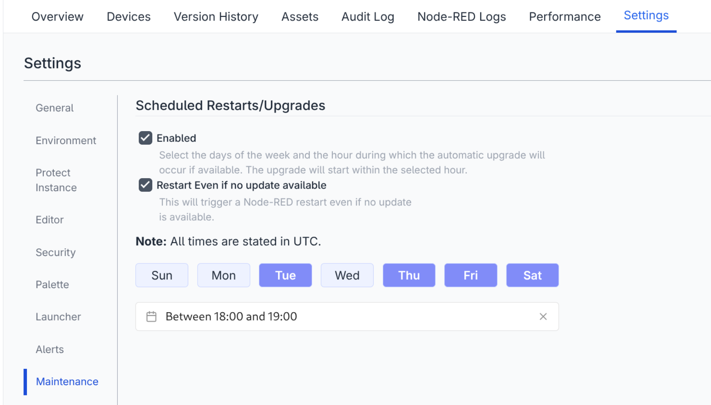
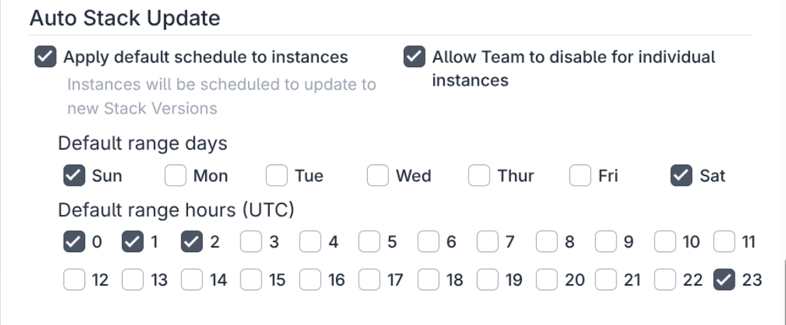

Included in the FlowFuse 2.25.0 release is the ability to schedule times and days of the 
week for Hosted Node-RED instances to upgrade to the latest available version.

This ensures that fixes and security updates are applied promptly.

_Maintenance Section of Instance Settings_

You can select multiple days of the week and an hour of the day the update will take 
place. The restart will be targeted in the first 30 minutes of the selected hour.

As well as scheduling upgrades, you can also enable scheduled restarts even if not update 
is available which may be useful to help with ensuring things run smoothly.

Self Hosted users can configure default restart/upgrade times at a TeamType level, 
FlowFuse Cloud Starter Tier users will have this enabled by default and it will run,
at weekends.

_TeamType Scheduled Maintenance Settings_