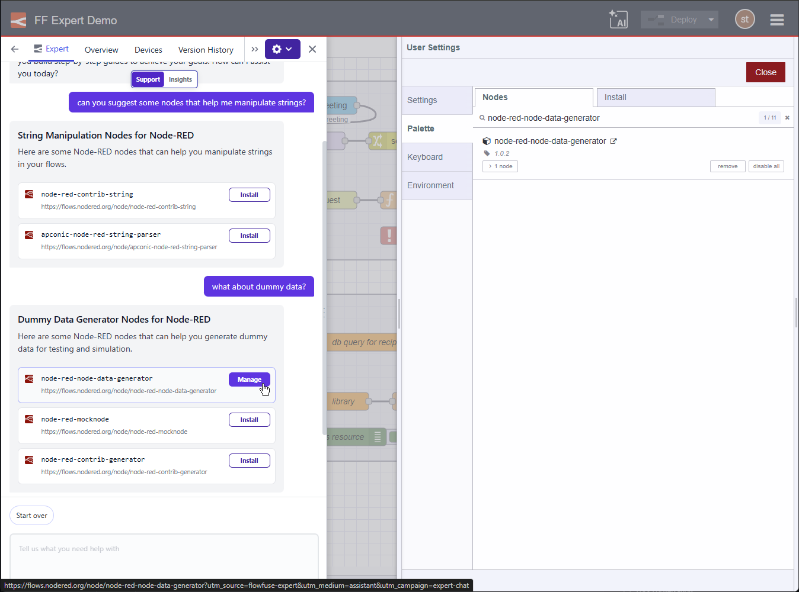

The FlowFuse Expert recently gained the ability to suggest and install **node packages** directly within your workflow (see our previous post on [FlowFuse Expert: Integration with Node-RED](/changelog/2026/01/ff-expert-nr-actions/)).

Today, we've streamlined this experience. The Expert now detects if a suggested node is already present in your instance. Instead of a showing the "Install" button, you’ll now see a **"Manage"** button that takes you directly to the Palette Manager.

{data-zoomable}
*FlowFuse Expert integration with the Palette Manager*

This improvement reduces friction when updating or configuring your existing nodes. These workflow integrations are just the beginning of our plans for the FlowFuse Expert. We're excited to see how much time they save you!
