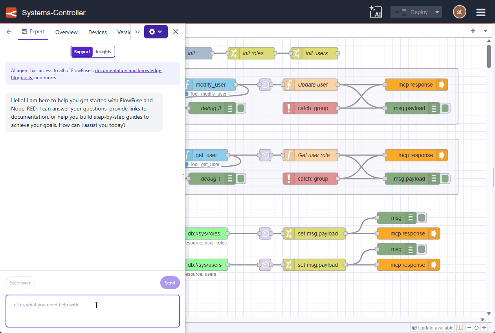

The FlowFuse Expert just got a lot more hands-on with your Node-RED editor:

* **Streamlined Node Installation:** When the Expert suggests a node module, it can now automatically open the Palette Manager and filter for the correct package, leaving you just one click away from installation.
* **Direct Flow Imports:** When the Expert provides demo flows, you no longer need to copy-paste JSON. The Expert can now inject those flows directly into your editor, ready for deployment.

{data-zoomable}
*FlowFuse Expert integration with the Palette Manager*

These workflow integrations are just the start of our plans for the FlowFuse Expert. We’re excited to see how much time these save you!