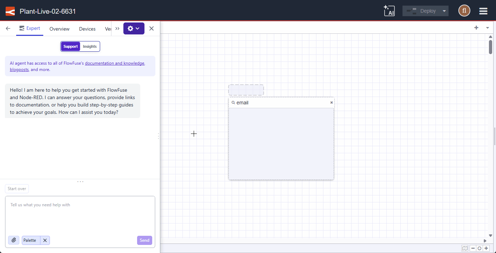

We are continuing to evolve the FlowFuse Expert by giving it deeper integration into your Node-RED environment. Starting today, the Expert has **Palette Awareness**.

You can now ask the Expert about your installed nodes, versions, and available updates without leaving the chat interface. For example:

- Do I have any nodes installed that can send Emails?
- Are my nodes up to date?
- or any question related to your palette.

This is one of several steps we are taking to bring additional context directly into your FlowFuse Expert to augment its capabilities and improve your workflow.

{data-zoomable}
*FlowFuse Expert integration with the Palette*

