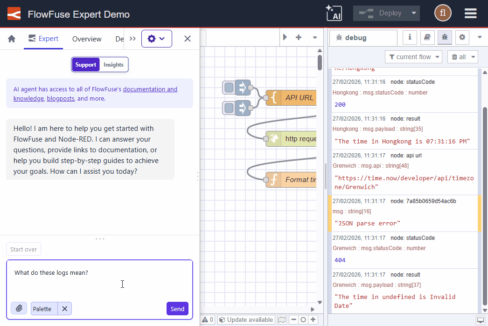

As a flow developer, you know how frustrating it can be to have a bug or issue in your flows. You add a ton of debug nodes and add warning alerts to your functions to try and help you track it down. The logs can be a great source of information but you still need to figure out why it is happening! Why am I getting this error? Where did this log come from? 

Now, you can ask the Expert!

We have added the ability to include individual log entries and a quick-add selection on the Resource Selector. Adding these logs alongside the related flows can further focus the AI on the issue and help you solve it.

**Key Highlights:**

- Laser Focus: Select individual log entries to provide specific context.
- Quick Add: Use the Resource Selector button to instantly pull in logs.

{data-zoomable}
*FlowFuse Expert Debug Log Context in Action*

{data-zoomable}
*FlowFuse Expert Focused Debug Log Context*

We are sure you will love this feature - and there is more to come too!
