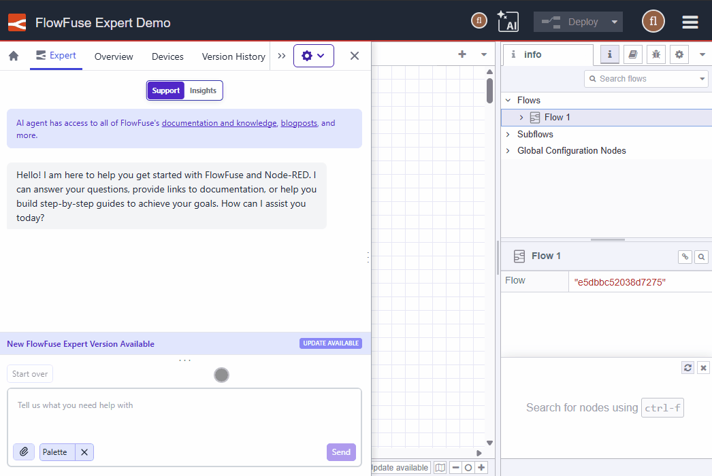

We have added a lot of goodness to the FlowFuse Expert, especially when working with your Node-RED flows. However, you may not be aware of this!

The FlowFuse Expert will now show a subtle banner in the chat area to remind you there is an update available.

{data-zoomable}
*FlowFuse Expert update banner*

We hope this helps you discover all the helpful features we are adding.
