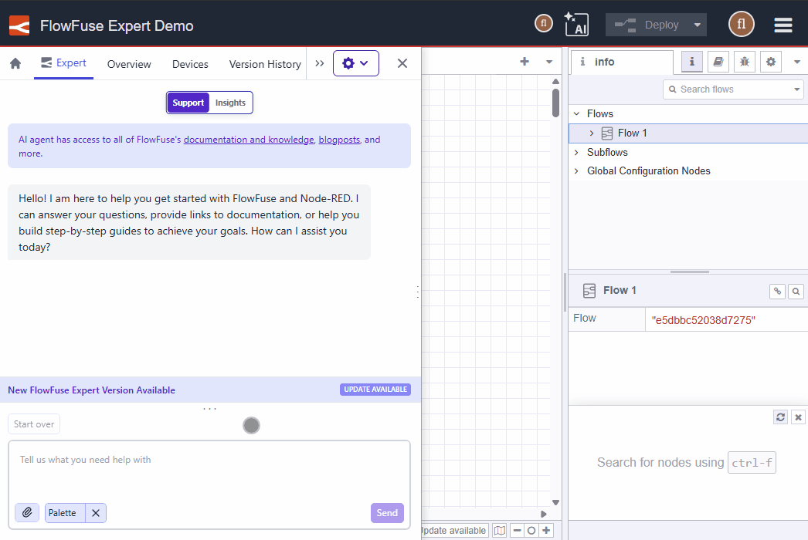

The Expert now shows a banner in the chat area when a newer version is available. One click and you are up to date.

FlowFuse Expert is updated regularly with new capabilities. This makes sure you always know when there is something new to try, without having to check manually.

*FlowFuse Expert lets you know when an update is available*

For more details, see [Keeping Expert up to date](/docs/user/expert/chat/#keeping-expert-up-to-date).
