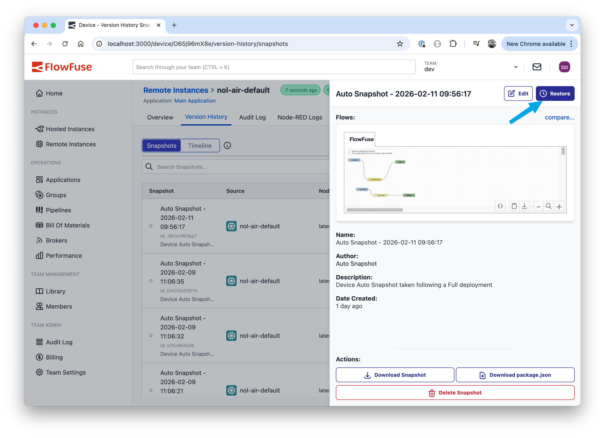

Device Agent version 3.8.0 has been released which brings a significant workflow improvement when editing your flows.

When the ability to remotely edit flows was introduced - known as 'developer mode' - we blocked the ability to push snapshots to a remote instance whilst in this mode. This protection makes sense when you're working on a remote instance, but still need to push updates out to the rest of your fleet through a pipeline deployment - you don't want the deployment from overwriting the work you're in the middle of.

However, there are cases where you want to rollback changes you've been making to a remote instance. Previously that would involve taking the instance out of developer mode, restoring the snapshot, then putting it back into developer mode to continue working. This is a lot of unnecessary steps and not an obvious workflow.

With the new v3.8.0 release of the Device Agent, it is now possible to manually restore snapshots without leaving developer mode:

 - Open the Version History tab for the Remote Instance and switch the Snapshots view
 - Click on the snapshot you want to use
 - Click on the restore button in the snapshot sidebar

 The existing protection that blocks pipeline-driven deploys of snapshots is still in place.

{data-zoomable}
_Restoring a snapshot to a Developer-Mode Remote Instance_
