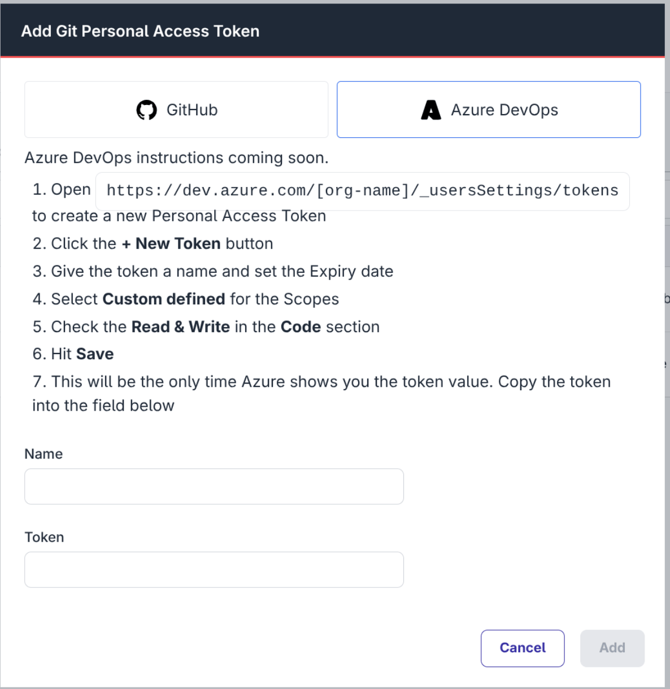

[DevOps Pipeline](https://flowfuse.com/docs/user/devops-pipelines) Git Stages can now make use Azure DevOps Git repositories in addition to GitHub.

This means you can both push and pull Snapshots to and from an Azure DevOps repository as part of a Pipeline.

Personal Access Tokens to access the repositories can be added under Team Settings -> Integrations

_Dialog to create a new Azure DevOps Token_

This is available to Pro and Enterprise customers on FlowFuse Cloud and Enterprise licensed Self Hosted installs.
