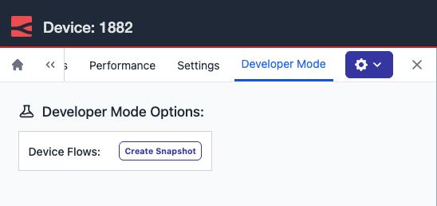

The Developer Mode tab is now available directly in the immersive editor drawer when working with remote instances. You can toggle auto snapshot and create snapshots without leaving the editor.

*The Developer Mode tab now appears directly in the immersive editor drawer, with options to create a snapshot and manage device flows.*

Previously, accessing Developer Mode meant opening a second browser window and navigating to the standalone device view, breaking your flow inside the editor and adding unnecessary friction, especially when working through a staged dev, test, and promote rollout.

This feature is available to Enterprise tier users of FlowFuse Cloud and Enterprise Licensed Self Hosted users from v2.29.
