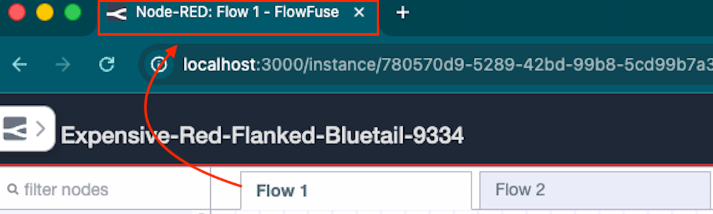
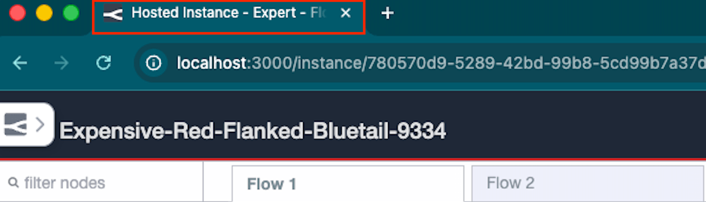

Now the browser tab title updates as you navigate the embedded editor. If you're working on a tab called "Sensor Flow", your browser will show `Node-RED: Sensor Flow - FlowFuse`. This works for both hosted and remote device instances, and also updates when you navigate into a subflow.

Previously the title stayed generic — something like `Instance - Editor - FlowFuse` — regardless of which canvas tab was active. If you had multiple embedded editors open in different browser tabs, there was no way to tell them apart at a glance.

*The browser tab now reflects the active canvas tab name.*

*Previously, the title stayed generic regardless of which canvas tab was active.*

This feature requires **Node-RED Assistant v0.12.0** or later. If you are on an older version of the assistant, the title will not update.

This change is live on FlowFuse Cloud. Self Hosted users will receive it in the next release (v2.29).
