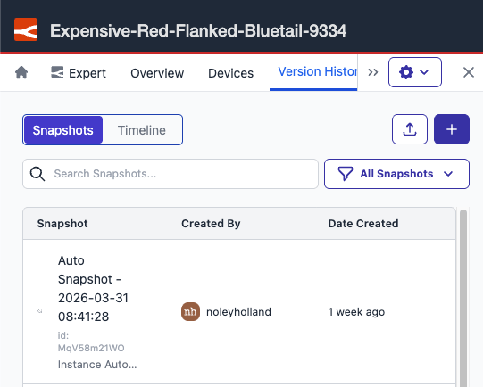
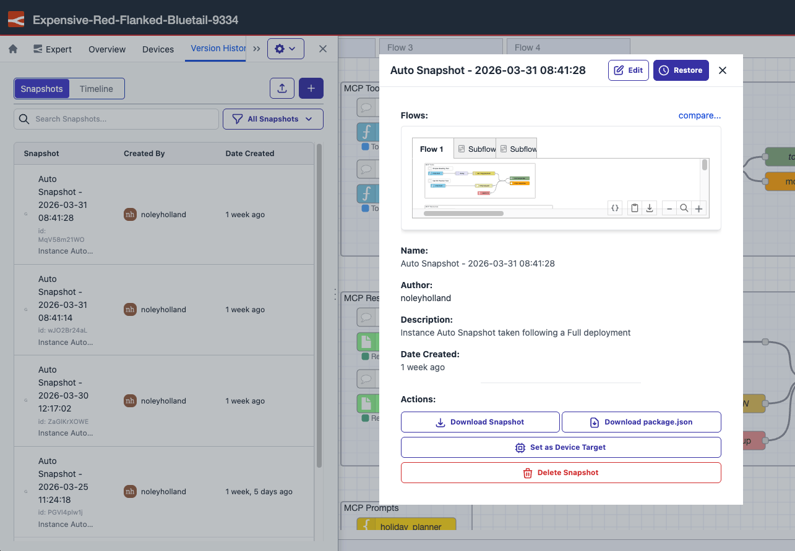

You can now open snapshot details from inside the immersive editor. Previously, clicking a snapshot from the Version History timeline or Snapshots list had no effect in the editor — the detail view was only available from the instance page in FlowFuse.

*Access snapshots from the Version History timeline or Snapshots list inside the editor.*

Snapshot details now open in a modal inside the immersive editor, so you can review and manage snapshots without leaving your editing session. The modal contains the same information as the snapshot detail view on the instance page.

*Snapshot details open in a modal inside the immersive editor.*

This feature is available to all FlowFuse Cloud users and all Self Hosted users from v2.29.
