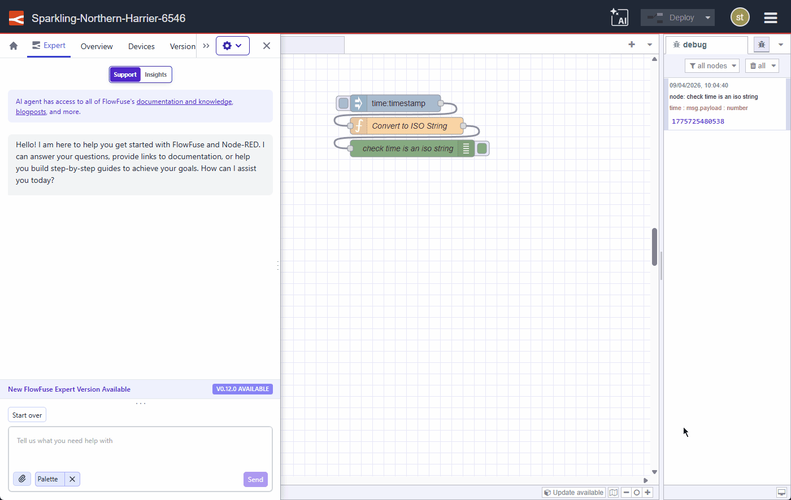
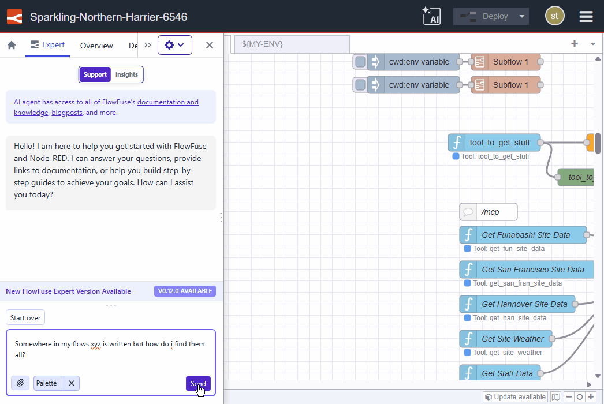

When interacting with the FlowFuse expert, you might be asked to search flows, select a node, or edit a node.
Previously, this was presented as a set of text instructions.
As of today, whenever possible, the Expert will provide clickable action links that will perform the operation for you.

{data-zoomable}
_Selecting and editing nodes._

{data-zoomable}
_Searching your flows_

This feature requires **Node-RED Assistant v0.12.0** or later.

This change is live on FlowFuse Cloud. Self-Hosted users will receive it in the next release (v2.29).
