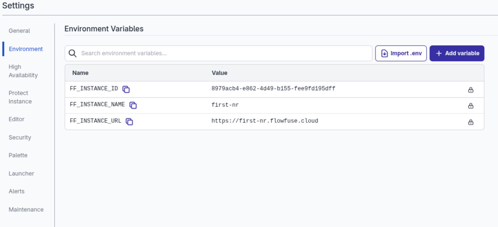

Hosted Instances now include an [Environment Variable](/docs/user/envvar/#standard-environment-variables) called `FF_INSTANCE_URL` which allows them to know what URL they can be reached on.

_ FF_INSTANCE_URL in list of Instance Environment Variables _

For Hosted Instances with a [Custom Hostname](/docs/user/custom-hostnames/#custom-hostnames) that will be returned rather than the default Instance hostname.

Existing instances will need to be restarted to pick up the new Environment Variable.

This will be available to Self Hosted users from v2.29.0.