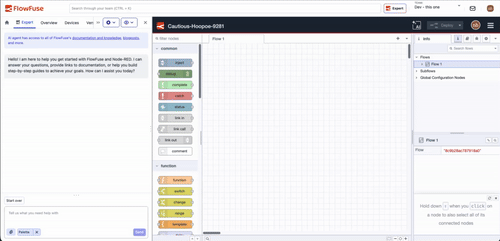

The drawer in the immersive editor used to float over your canvas, blocking parts of your flow whenever it was open. Now it sits inside the editor layout, so FlowFuse tools stay visible alongside your work in Node-RED. You can also set it up the way you like, and it stays that way every time you come back:

{data-zoomable}
*Pin, switch sides, or go full-screen from the drawer header, your settings persist between sessions.*

- **Pin the drawer** to dock it alongside the canvas, and the Node-RED editor resizes to fit.
- **Switch sides** to move the drawer to the left or right of the screen.
- **Go full-screen** to hide the FlowFuse topbar and give the canvas maximum space.
- **Resize the drawer** to whatever width works best for you.

The drawer opens by default the first time you visit the editor. After that, your browser remembers your choices between sessions.

This feature is available to all FlowFuse Cloud users and Self Hosted users from v2.30.
